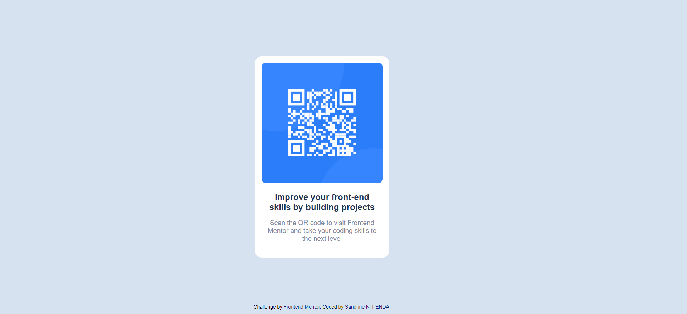
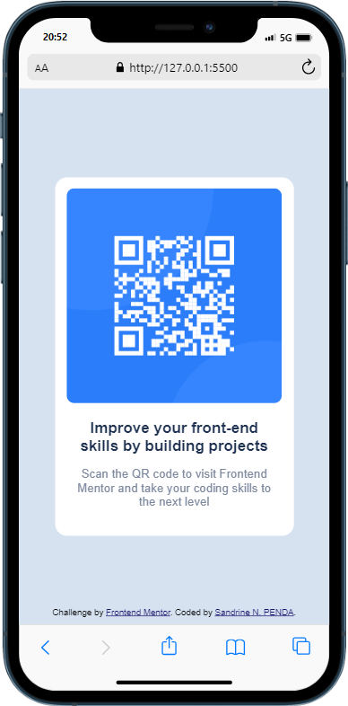

# Frontend Mentor - QR code component solution

This is a solution to the [QR code component challenge on Frontend Mentor](https://www.frontendmentor.io/challenges/qr-code-component-iux_sIO_H). Frontend Mentor challenges help you improve your coding skills by building realistic projects.

## Table of contents

- [Overview](#overview)
  - [Screenshots](#screenshot)
  - [Links](#links)
- [My process](#my-process)
  - [Built with](#built-with)
  - [What I learned](#what-i-learned)
  - [Continued development](#continued-development)
  - [Useful resources](#useful-resources)
- [Author](#author)
- [Acknowledgments](#acknowledgments)

**Note: Delete this note and update the table of contents based on what sections you keep.**

## Overview

### Screenshot

### Links

- Solution URL: [Add solution URL here](https://your-solution-url.com)
- Live Site URL: [Add live site URL here](https://your-live-site-url.com)

## My process

I drew and cut out the model on a piece of paper, mentioning the semantic tag for each block. This made it easy to write down the structure of the web page.

### Built with

- Semantic HTML5 markup
- CSS3 custom properties
- Flexbox

### What I learned

It is not something new, but **I really appreciate to integrate! :)**

### Continued development

For the next projects, I expect to implement the using of preprocessor as Sass.

### Useful resources

- [Mozilla Documentation](https://developer.mozilla.org/) - This helped me for finding the right syntax of a CSS property and its value I looked for.
- [To validate my HTML5 code](https://jigsaw.w3.org/css-validator/#validate_by_input) - I've used it to ensure that my code complies with W3C standards, and to correct where necessary.
- [To validate my CSS code](https://validator.w3.org/#validate_by_input) - This is the equivalent for the CSS3. Using these both validators is a good coding practice.

## Author

- Frontend Mentor - [@SandrinePENDA](https://www.frontendmentor.io/profile/SandrinePENDA)
- LinkedIn - [@sandrine-penda](https://www.linkedin.com/in/sandrine-penda)
